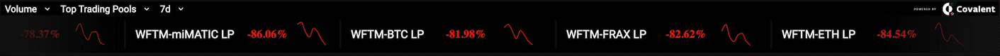

# Flaunt your DEX data with this widget
This widget is designed as a React component to show a gist of your DEX data. It gives you details about `volume `and `liquidity` percentage change of `Top Trading Pools` and `Top Tokens` on the DEX for `24h` and `7d` data.



## Installation
```sh
npm install @covalenthq/dex-widget-react-library@0.1.1
```

## Usage
To use the component, first import `Widget` into your file:
```jsx
import { Widget } from '@covalenthq/dex-widget-react-library'; 
```

### Example code
A sample code in a React App would look like
```jsx
import { Widget } from "@Calm-Rock/dex-widget";
function App() {
  return (
      <Widget 
        chain_id='1'
        dex_name='sushiswap'
        api_key='ckey_4e73d56514984838ab3206fbaf4'
        bg_color='grey'
        text_color='white'
      /> 
  );
}

export default App;
```
## Live Demo
See a live demo of the DEX widget [here](https://covalenthq.github.io/dex-widget-demo/)

## Props

| Property |Description | Example |
| -------- | -------- | -------- |
| `chain_id`     | The blockchain id     | `"1"` for Ethereum mainnet
| `dex_name`     | The DEX name     |`"sushiswap"`
| `api_key`     | Covalent API key     |`"ckey_..."`
| `bg_color`     | Background color of the widget     |`"#000000"` for black
| `text_color`     | Text color of dropdown & ticker pair|`"#FFFFFF"` for white


## Feedback and Support
If you have any questions, comments, issues and feedback regarding this code template, please message us on [Discord](https://covalenthq.com/discord).

## About Covalent
Covalent provides the industry-leading Unified API bringing visibility to billions of Web3 data points. 


Developers use Covalent to build exciting multi-chain applications like crypto wallets, NFT galleries, and investor dashboard tools utilizing data from 26+ blockchains. Covalent is trusted by a community of 15,000+ developers and powers data for 500+ applications including 0x, Zerion, Rainbow Wallet, Rotki, Bitski and many others.

Register and get your own Covalent API key [here](https://www.covalenthq.com/platform)

[Website](https://www.covalenthq.com) | [Discord](https://covalenthq.com/discord) | [Telegram](https://t.me/CovalentHQ) | [Twitter](https://twitter.com/covalent_hq) | [YouTube](https://www.youtube.com/channel/UCGn-T9qPiXAx490Wr6WPbOw) | [WeChat](https://mp.weixin.qq.com/s?__biz=MzU0MzY5ODMzMg==&mid=2247483899&idx=1&sn=9c1d4df3acc04bc35c429b244307d3c7&chksm=fb063d08cc71b41e2da96b4747513acf2ab9182babe57c135e4a7d1fef9255eb3b310217835c&token=2144505038&lang=zh_CN#rd)